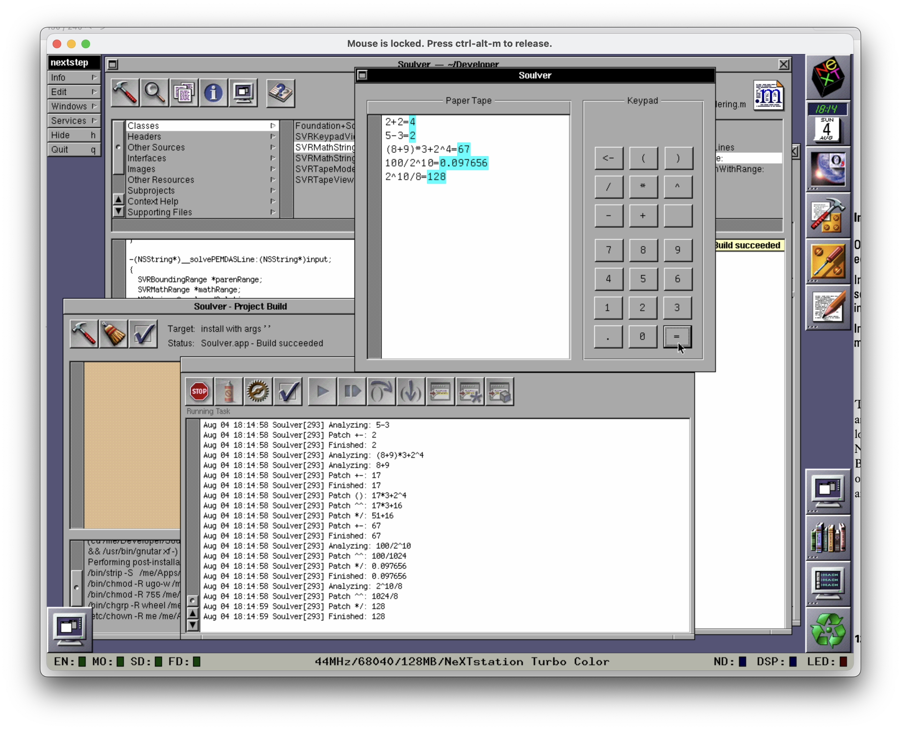

# \[Not\] Soulver for OpenStep 4.2
A rudimentary calculator inspired by Soulver written in ancient Objective C that compiles and runs in OpenStep 4.2. The calculator logic also compiles and runs properly in Xcode 16. I guess that says a lot about the stability of Objective C and Foundation over the years.

## Disclaimer
This is not associated with Soulver in any way, just inspired by. I created this app when I was sick with COVID and needed something dumb to do while I wasted away at home.

## How to Use
Use the keypad to type in a mathematical formula. When you click on the `=` key, the program will solve the formula for you.

### App Features
- Full PEMDAS order of operations support
- Next line can include answer from previous line
- Answer on current line and next line, if applicable, is colored
- (Soon) NSDocument support
- (Soon) Keyboard input support
- (Maybe) Syntax highlighting

## How it Works
As the user clicks keys, a string is created character by character. The string is always stored as raw user input. But every time there is new user input, a custom `render` method is called on the String. From there, the raw user input is broken into lines by the `=` signs and each line is sent to a PEMDAS solving method which recursively calls itself until there is only a number (no mathematical operations) left in the string. That is then appended after the equals sign in the rendered output. The rendering uses `NSAttributedString` to do the coloring.

### Technical Features
- Manual Reference Counting 😅
- Only uses Foundation methods that were available in Mac OS X 10.0 🥵
- NSMutableString-based string manipulation 😵
- Original user input is always preserved (not mixed with rendering)

### Known Problems
- The PEMDAS solver could be made more resilient
    - For example, it does not support uneven or nested parentheses